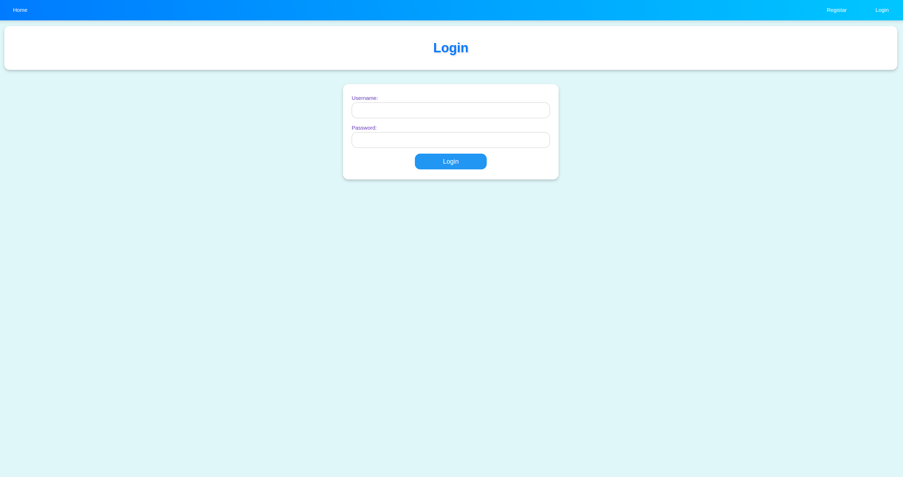
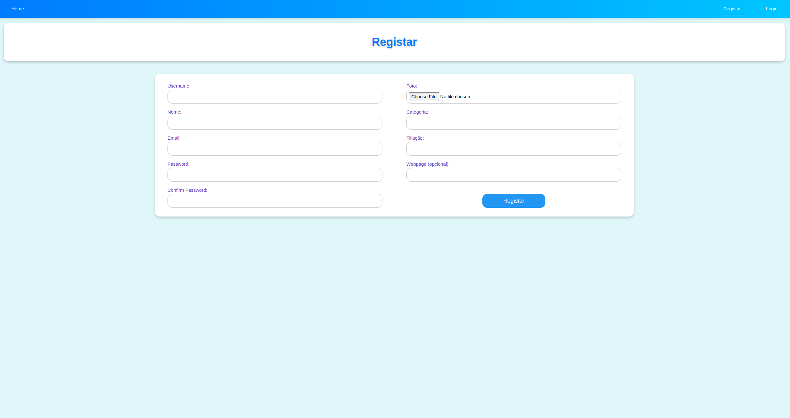
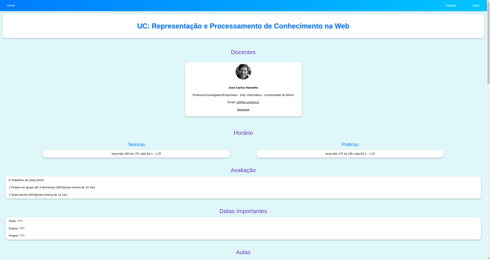
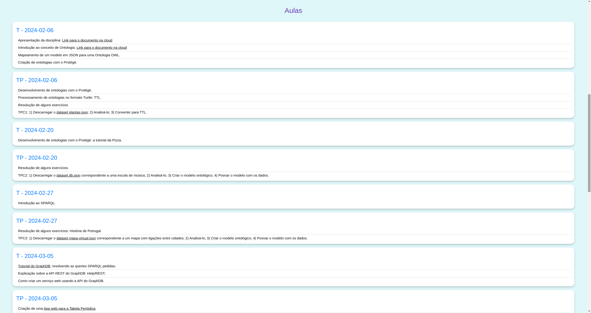
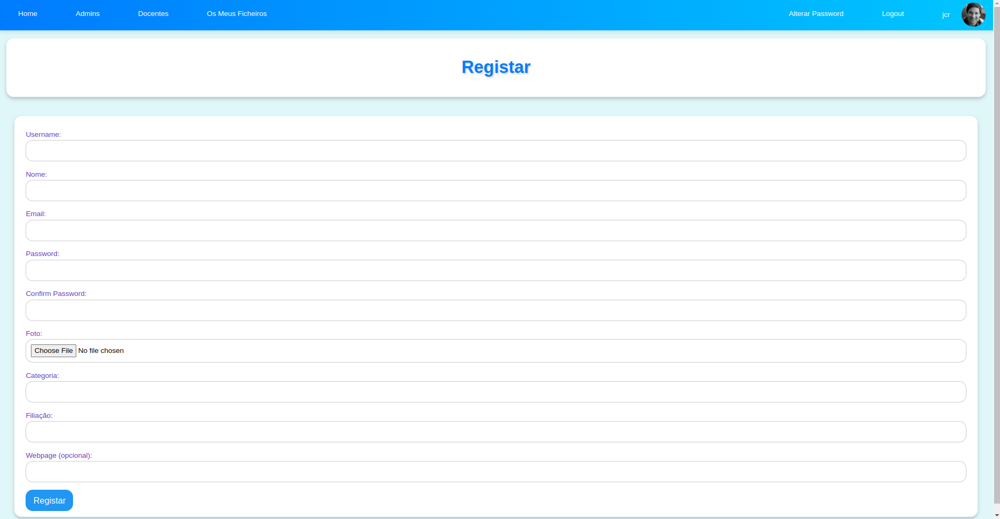
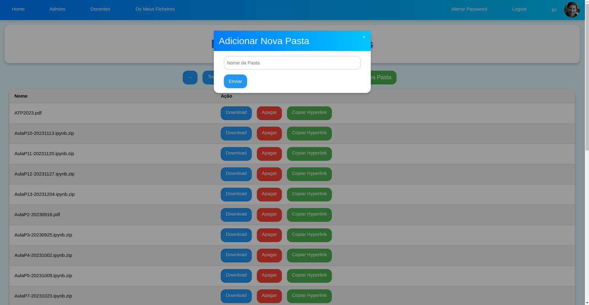
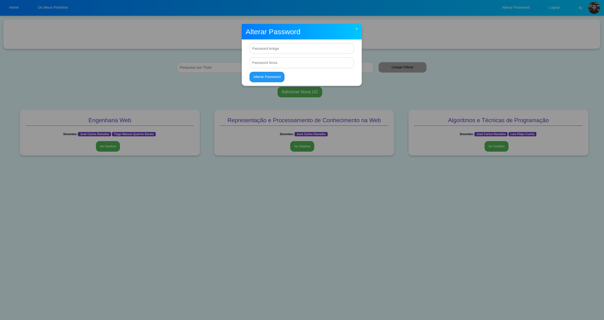
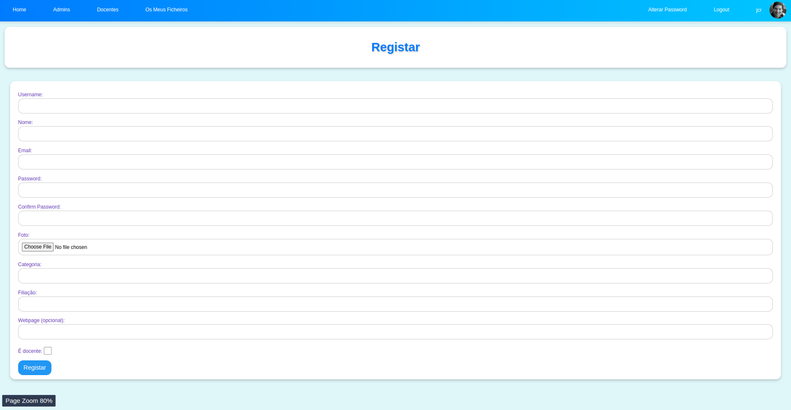
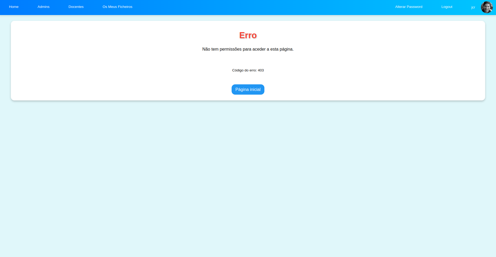

# Relatório do Projeto

## Introdução

Este projeto envolve a criação de uma plataforma web para a gestão e consulta de Unidades Curriculares (UCs). Utiliza Node.js, Express.js, MongoDB e Docker para fornecer uma solução completa e modular. A plataforma é composta por três serviços principais: Servidor de API de Dados, Servidor de Autenticação e Servidor de Interface.

O conteúdo inicial já contém dados de exemplo (ATP2023, RPCW2024 e EngWeb2024), incluíndo os seus ficheiros.

## Estrutura do Projeto

### 1. **API de Dados (`api-geradorUCs`)**

#### Função

Implementa operações CRUD para UCs e Docentes, expondo funcionalidades através de uma API RESTful.

#### Principais Componentes

- **Modelos**
  - **`Docente`**: Representa os docentes com propriedades como `nome`, `categoria`, `filiacao`, `email`, `webpage`, e `fotoExt`.
  - **`UC`**: Representa as Unidades Curriculares, incluindo informações como `titulo`, `docentes`, `horario`, `avaliacao`, `datas`, `aulas`, e `criador`.

- **Controladores**
  - **`docente.js`**: Contém funções para listar, procurar por ID, inserir, atualizar e remover docentes.
  - **`uc.js`**: Similar ao controlador de docentes, mas para operações relacionadas às UCs.

- **Rotas**
  - **`docentes.js`**: Define endpoints para operações CRUD sobre docentes (`/docentes`).
  - **`ucs.js`**: Define endpoints para operações CRUD sobre UCs (`/ucs`).

- **Configuração do Servidor**
  - **`www`**: Configura o servidor HTTP, define a porta e gere eventos de erro e de escuta.

- **Ficheiro de Inicialização**
  - **`app.js`**: Configura o Express, define middleware e rotas, e gere a conexão com o MongoDB.

#### Docker

A API é colocada num container usando Docker. O `Dockerfile` define o ambiente de execução, e o `Dockerfile-seed` é usado para inicializar a base de dados com dados de exemplo.

### 2. **Autenticação (`auth-geradorUCs`)**

#### Função

Lida com a autenticação dos utilizadores, utilizando tokens JWT para verificar a sessão e controlar o acesso.

#### Principais Componentes

- **Modelo `User`**
  - Define o modelo do utilizador, incluindo campos como `username`, `password`, `email`, `name`, e `level`.
  - Usa `passport-local-mongoose` para simplificar a autenticação com Passport.js.

- **Rotas**
  - **`index.js`**: Inclui rotas para registo (`/register`), registo de administradores (`/registerAdmin`), login (`/login`) verificação de sessão (`/isLogged`), listar administradores (`/admins`), apagar administradores (`/deleteAdmin`) e alterar palavra-passe (`/changePassword`).

- **Middleware de Autenticação**
  - **`auth.js`**: Middleware que verifica e valida tokens JWT fornecidos nas requisições, e gere erros de autenticação.

- **Configuração do Servidor**
  - **`www`**: Configura o servidor HTTP, define a porta e gere eventos de erro e de escuta.

- **Arquivo de Inicialização**
  - **`app.js`**: Configura o Express, define middleware, gere a sessão do utilizador com Passport.js e Express-Session, e configura a conexão com o MongoDB.

#### Docker

O serviço de autenticação é configurado para ser executado em um container Docker, garantindo a segurança e o isolamento do ambiente de autenticação.

### 3. **Interface HTML (`html-geradorUCs`)**

#### Função

Fornece a interface ao utilizador para integração com a plataforma, permitindo a gestão visual de UCs e Docentes.

#### Principais Componentes

- **Rotas**
  - **`index.js`**: gere o rendering das páginas cujos botões existem na página inicial e header, bem como o login, registo, logout, alterar password e adicionar e remover administradores (no caso de já ser um).
  - **`uc.js`**: gere a adição, edição e visualização de detalhes das UCs.
  - **`addDocente.js`**: gere a adição de novos docentes.
  - **`files.js`**: gere o upload, download e organização de ficheiros dos utilizadores.

- **Views**
  - **`index.pug`**: Página principal que lista todas as UCs.
  - **`addUC.pug`**: Formulário para adicionar uma nova UC.
  - **`editUC.pug`**: Formulário para editar uma UC existente.
  - **`addDocente.pug`**: Formulário para adicionar um novo docente.
  - **`addAdmin.pug`**: Formulário para adicionar um novo Administrador.
  - **`uc.pug`**: Página de detalhes de uma UC específica.
  - **`login.pug`**: Formulário de login do utilizador.
  - **`signup.pug`**: Formulário de registo de novo utilizador.
  - **`files.pug`**: Interface para gestão de ficheiros dos utilizadores.
  - **`admins.pug`**: Interface para gestão de administradores.
  - **`error.pug`**: Página de erro para exibição de mensagens de erro.
  - **`success.pug`**: Página de sucesso para exibição de mensagens de sucesso.

- **Configuração do Servidor**
  - **`www`**: Configura o servidor HTTP, define a porta e gere eventos de erro e de escuta.

- **Arquivo de Inicialização**
  - **`app.js`**: Configura o Express, define middleware, gere cookies, e define rotas estáticas para ficheiros públicos.

#### Docker

A interface HTML é configurada para ser executada em um container Docker, garantindo consistência entre diferentes ambientes de execução.

## Scripts de Automação

- **`export.sh`**: Exporta dados do MongoDB para ficheiros JSON.
- **`import.sh`**: Importa dados de ficheiros JSON para o MongoDB (processo inverso).
- **Scripts de gestão Docker**:
  - **`install.sh`**: Constrói e inicia os containers Docker.
  - **`uninstall.sh`**: Para e remove os containers Docker e suas imagens.
  - **`reinstall.sh`**: Reinstala os containers Docker, removendo os existentes e construindo novos.

## Funcionalidades do Site

### 1. **Página Principal**

- **Pesquisa de UCs**: Permite aos utilizadores pesquisar UCs por título e docente.
- **Listagem de UCs**: Apresenta uma lista de todas as UCs disponíveis com a opção de ver detalhes, editar ou eliminar (conforme as permissões do utilizador).

### 2. **Gestão de UCs**

- **Adicionar UC**: Formulário para adicionar uma nova UC, especificando título, docentes, horários, avaliação e datas importantes.
- **Editar UC**: Formulário para editar uma UC existente, permitindo a atualização de todas as informações associadas, incluindo adicionar e remover aulas. Para adicionar um ficheiro ou link a um sumário de uma aula, pode-se utilizar a notação MD, por exemplo: "`[Nome do Ficheiro](./<CaminhoParaOFicheiro>)`", para ficheiros que já estão carregados na plataforma do utilizador; ou então simplesmente, no `<CaminhoParaOFicheiro>` colocar qualquer link externo que, com a ajuda de REGEX, o programa reconhece que o é. Para simplificação, existe um botão "Copiar HyperLink" em cada ficheiro, na página dos ficheiros, que copia automaticamente.
- **Eliminar UC**: Opção para eliminar uma UC, disponível apenas para criadores ou administradores.

### 3. **Gestão de Docentes**

- **Adicionar Docente**: Formulário para adicionar um novo docente, incluindo upload de foto e informações de contato.

### 4. **Gestão de Ficheiros**

- **Upload de Ficheiros**: Permite aos utilizadores fazer upload de ficheiros.
- **Download de Ficheiros**: Permite aos utilizadores baixar ficheiros carregados.
- **Criação de Pastas**: Permite a organização de ficheiros em pastas.
- **Eliminação de Ficheiros/Pastas**: Opção para eliminar ficheiros e pastas.

### 5. **Autenticação e Autorização**

- **Registo de Utilizador**: Formulário para criar uma nova conta de utilizador.
- **Registo de Administrador**: Formulário para criar uma nova conta de Administrador, caso já seja um.
- **Consulta e Remoção de Utilizadores**: Página que permite visualizar os administradores que existem, e remover caso seja necessário.
- **Alteração de Password**: Formulário para alterar a password do utilizador.
- **Login**: Formulário de login que autentica os utilizadores e gera um token JWT.
- **Logout**: Opção de logout que termina a sessão do utilizador.
- **Verificação de Sessão**: Verifica se um utilizador está autenticado e se o token JWT é válido.

### 6. **Páginas de Erro**

- **Página de Erro**: Apresenta mensagens de erro detalhadas quando ocorrem problemas na aplicação, como erros de autenticação ou problemas com a base de dados.

## Docker Compose

A orquestração dos serviços é realizada com Docker Compose. O `docker-compose.yml` define a configuração dos serviços, volumes e redes necessários para a operação da plataforma, incluindo:

- **Serviço MongoDB**: Base de dados MongoDB.
- **Serviço de Seed MongoDB**: Inicializa a base de dados com dados de exemplo.
- **Serviço API**: Executa o servidor da API de dados.
- **Serviço de Autenticação**: Executa o servidor de autenticação.
- **Serviço de Interface HTML**: Executa o servidor da interface.

## Conclusão

Este projeto representa uma solução integrada e modular para a gestão de UCs, destacando-se pela sua arquitetura baseada em micro serviços e pela facilidade de implantação e manutenção proporcionada pelo docker. A estrutura modular e o uso do Docker garantem escalabilidade e flexibilidade, tornando o sistema fácil de manter e expandir.

## Screenshots do Site

### Página Inicial (não autenticado)

### Página Inicial (Administrador)

### Página de Login

### Página de Registo

### Página de uma UC

### Página da edição de uma UC

### Página de Adicionar uma UC

### Página de Adicionar um Docente

### Página de Ficheiros de um Utilizador

### Página de Mudar Password

### Página de Adicionar Administrador

### Página de Gestão Administradores

### Página de Sucesso

### Página de Erro

